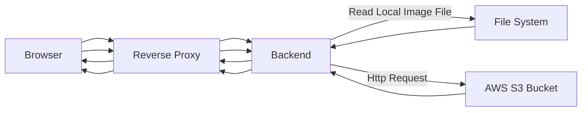
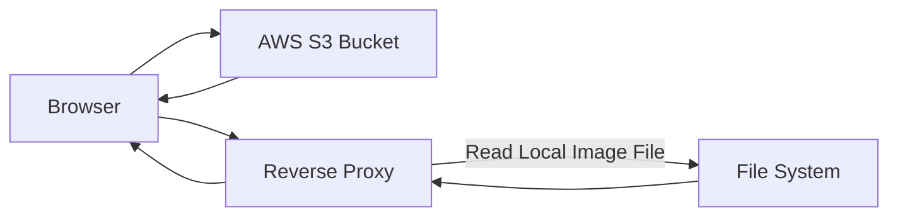

# Imageable Upload System

A module for uploading and managing images.

## Installation Guide

Install the package using Composer.

```bash
composer require elysiumrealms/imageable
```

Run the migrations.

```bash
php artisan migrate
```

## Implementation Guide

Use the `ImageableTrait` trait to your model.

```php
use Elysiumrealms\Imageable;

class User extends Model
implements Imageable\Contracts\Imageable
{
    use Imageable\Traits\ImageableTrait;

    ...
}
```

Schedule the `imageable:prune` command to prune deleted images.

```php
function schedule(Schedule $schedule)
{
    $schedule->command('imageable:prune')
        ->onOneServer()
        ->daily();
}
```

## Storage Mode Configuration

The imageable module supports two storage modes:

### **_Proxy Forwarding Mode_**

Images are stored locally on the backend server or **_AWS S3 Bucket_**, access all images through `imageable/{image}` route.



The **_Proxy Forwarding Mode_** is designed for cases where **_AWS S3 Bucket_** is not available or when the system is not yet deployed to a production environment. In production, the **_Direct Storage Mode_** is preferred to reduce backend system I/O and improve performance.

### **_Direct Storage Mode_** (Recommended for Production)

Images are stored in an **_AWS S3 Bucket_**, and the system returns the full **_AWS S3 Bucket_** URL or file path for access.



In direct **_Direct Storage Mode_** mode, all images will be served directly from **_AWS S3 Bucket_** or file path on the backend server.

## Deployment Considerations

### **Development/Test Environments**

-   Use **_Proxy Forwarding Mode_** to simulate image retrieval before setting up **_AWS S3 Bucket_**.

### **Production Environment**

-   Use **_Direct Storage Mode_** to reduce backend load and improve performance.
-   Set the **_Storage Mode_** through `IMAGEABLE_DRIVER` environment variable to desired driver.

## Configuration

-   When using **_Direct Storage Mode_** and `s3` driver, ensure proper **_AWS S3 Bucket_** permissions and bucket policies.
-   Configure reverse proxy rules to handle image routing when using **_Proxy Forwarding Mode_**.

## Usage Guide

-   Upload images through the `POST /api/v1/imageable/{collection}` route.

    ```bash
    curl -X POST http://localhost:8000/api/v1/imageable/default \
        -H "Authorization: Bearer {token}" \
        -H "Content-Type: multipart/form-data" \
        -F "images[]=@/path/to/your/xxx_01.jpg" \
        -F "images[]=@/path/to/your/xxx_02.jpg" \
        -F "images[]=@/path/to/your/xxx_03.jpg"
    ```

-   Delete images through the `DELETE /api/v1/imageable` route.

    ```bash
    curl -X DELETE http://localhost:8000/api/v1/imageable/ \
        -H "Authorization: Bearer {token}"
        -H "Content-Type: application/json"
        -d '{"images": ["xxx_01.jpg", "xxx_02.jpg", "xxx_03.jpg"]}'
    ```

-   Get images paginated through the `GET /api/v1/imageable` route.

    ```bash
    curl -X GET http://localhost:8000/api/v1/imageable \
        -H "Authorization: Bearer {token}"
        -H "Content-Type: application/json"
        -d '{"page": 1, "per_page": 10}'
    ```

-   Access the images through the `images` relationship.

    ```php
    User::find(1)->images;
    ```

For further details, please contact the development team.
